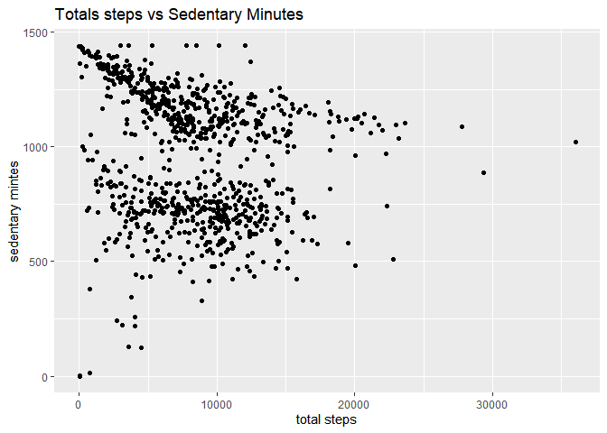
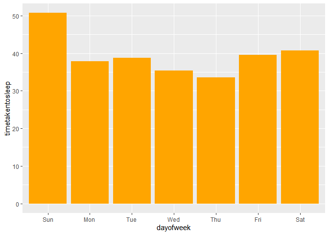

Google Data Analytics Capstone : Bellabeat
================
Osarenoma Abu
2022-05-10


## Introduction and background

Urška Sršen and Sando Mur founded Bellabeat, a high-tech company that
manufactures health-focused smart products. Collecting data on activity,
sleep, stress, and reproductive health has allowed Bellabeat to empower
women with knowledge about their own health and habits.

By 2016, Bellabeat had opened offices around the world and launched
multiple products. Bellabeat products became available through a growing
number of online retailers in addition to their own e-commerce channel
on their website. The company has invested in traditional advertising
media, such as radio, out-of-home billboards, print, and television, but
focuses on digital marketing extensively.

Sršen has asked the marketing analytics team to focus on a Bellabeat
product and analyze smart device usage data in order to gain insight
into how people are already using their smart devices.

## Business Task

To analyse FitBit Fitness Tracker Data to gain insights on how consumers
are using the smart devices and discover trends for Bellabeat’s
marketing strategy

## Installing and loading common packages and libraries

``` r
library(tidyverse)
```

    ## ── Attaching packages ─────────────────────────────────────── tidyverse 1.3.1 ──

    ## ✔ ggplot2 3.3.6     ✔ purrr   0.3.4
    ## ✔ tibble  3.1.7     ✔ dplyr   1.0.9
    ## ✔ tidyr   1.2.0     ✔ stringr 1.4.0
    ## ✔ readr   2.1.2     ✔ forcats 0.5.1

    ## ── Conflicts ────────────────────────────────────────── tidyverse_conflicts() ──
    ## ✖ dplyr::filter() masks stats::filter()
    ## ✖ dplyr::lag()    masks stats::lag()

``` r
library(janitor) 
```

    ## 
    ## Attaching package: 'janitor'

    ## The following objects are masked from 'package:stats':
    ## 
    ##     chisq.test, fisher.test

``` r
library(ggplot2)
library(lubridate)  
```

    ## 
    ## Attaching package: 'lubridate'

    ## The following objects are masked from 'package:base':
    ## 
    ##     date, intersect, setdiff, union

``` r
library(dplyr)
library(skimr) 
```

## Loading CSV files

``` r
daily_activity <- read.csv("dailyActivity_merged.csv")
sleep_day <- read.csv("sleepDay_merged.csv")
```

## Exploring the data

``` r
head(daily_activity)
```

    ##           Id ActivityDate TotalSteps TotalDistance TrackerDistance
    ## 1 1503960366    4/12/2016      13162          8.50            8.50
    ## 2 1503960366    4/13/2016      10735          6.97            6.97
    ## 3 1503960366    4/14/2016      10460          6.74            6.74
    ## 4 1503960366    4/15/2016       9762          6.28            6.28
    ## 5 1503960366    4/16/2016      12669          8.16            8.16
    ## 6 1503960366    4/17/2016       9705          6.48            6.48
    ##   LoggedActivitiesDistance VeryActiveDistance ModeratelyActiveDistance
    ## 1                        0               1.88                     0.55
    ## 2                        0               1.57                     0.69
    ## 3                        0               2.44                     0.40
    ## 4                        0               2.14                     1.26
    ## 5                        0               2.71                     0.41
    ## 6                        0               3.19                     0.78
    ##   LightActiveDistance SedentaryActiveDistance VeryActiveMinutes
    ## 1                6.06                       0                25
    ## 2                4.71                       0                21
    ## 3                3.91                       0                30
    ## 4                2.83                       0                29
    ## 5                5.04                       0                36
    ## 6                2.51                       0                38
    ##   FairlyActiveMinutes LightlyActiveMinutes SedentaryMinutes Calories
    ## 1                  13                  328              728     1985
    ## 2                  19                  217              776     1797
    ## 3                  11                  181             1218     1776
    ## 4                  34                  209              726     1745
    ## 5                  10                  221              773     1863
    ## 6                  20                  164              539     1728

Identifying all the columns in the daily_activity data.

``` r
colnames(daily_activity)
```

    ##  [1] "Id"                       "ActivityDate"            
    ##  [3] "TotalSteps"               "TotalDistance"           
    ##  [5] "TrackerDistance"          "LoggedActivitiesDistance"
    ##  [7] "VeryActiveDistance"       "ModeratelyActiveDistance"
    ##  [9] "LightActiveDistance"      "SedentaryActiveDistance" 
    ## [11] "VeryActiveMinutes"        "FairlyActiveMinutes"     
    ## [13] "LightlyActiveMinutes"     "SedentaryMinutes"        
    ## [15] "Calories"

Taking a look at the sleep_day data.

``` r
head(sleep_day)
```

    ##           Id              SleepDay TotalSleepRecords TotalMinutesAsleep
    ## 1 1503960366 4/12/2016 12:00:00 AM                 1                327
    ## 2 1503960366 4/13/2016 12:00:00 AM                 2                384
    ## 3 1503960366 4/15/2016 12:00:00 AM                 1                412
    ## 4 1503960366 4/16/2016 12:00:00 AM                 2                340
    ## 5 1503960366 4/17/2016 12:00:00 AM                 1                700
    ## 6 1503960366 4/19/2016 12:00:00 AM                 1                304
    ##   TotalTimeInBed
    ## 1            346
    ## 2            407
    ## 3            442
    ## 4            367
    ## 5            712
    ## 6            320

Identifying all the columns in the daily_activity data.

``` r
colnames(sleep_day)
```

    ## [1] "Id"                 "SleepDay"           "TotalSleepRecords" 
    ## [4] "TotalMinutesAsleep" "TotalTimeInBed"

We can see that the three datasets have the ‘Id’ field - this can be
used to merge the datasets into one.

### Cleaning the data

#### Removing duplicates and checking for missing values

``` r
duplicated(daily_activity[,1:2])
```

    ##   [1] FALSE FALSE FALSE FALSE FALSE FALSE FALSE FALSE FALSE FALSE FALSE FALSE
    ##  [13] FALSE FALSE FALSE FALSE FALSE FALSE FALSE FALSE FALSE FALSE FALSE FALSE
    ##  [25] FALSE FALSE FALSE FALSE FALSE FALSE FALSE FALSE FALSE FALSE FALSE FALSE
    ##  [37] FALSE FALSE FALSE FALSE FALSE FALSE FALSE FALSE FALSE FALSE FALSE FALSE
    ##  [49] FALSE FALSE FALSE FALSE FALSE FALSE FALSE FALSE FALSE FALSE FALSE FALSE
    ##  [61] FALSE FALSE FALSE FALSE FALSE FALSE FALSE FALSE FALSE FALSE FALSE FALSE
    ##  [73] FALSE FALSE FALSE FALSE FALSE FALSE FALSE FALSE FALSE FALSE FALSE FALSE
    ##  [85] FALSE FALSE FALSE FALSE FALSE FALSE FALSE FALSE FALSE FALSE FALSE FALSE
    ##  [97] FALSE FALSE FALSE FALSE FALSE FALSE FALSE FALSE FALSE FALSE FALSE FALSE
    ## [109] FALSE FALSE FALSE FALSE FALSE FALSE FALSE FALSE FALSE FALSE FALSE FALSE
    ## [121] FALSE FALSE FALSE FALSE FALSE FALSE FALSE FALSE FALSE FALSE FALSE FALSE
    ## [133] FALSE FALSE FALSE FALSE FALSE FALSE FALSE FALSE FALSE FALSE FALSE FALSE
    ## [145] FALSE FALSE FALSE FALSE FALSE FALSE FALSE FALSE FALSE FALSE FALSE FALSE
    ## [157] FALSE FALSE FALSE FALSE FALSE FALSE FALSE FALSE FALSE FALSE FALSE FALSE
    ## [169] FALSE FALSE FALSE FALSE FALSE FALSE FALSE FALSE FALSE FALSE FALSE FALSE
    ## [181] FALSE FALSE FALSE FALSE FALSE FALSE FALSE FALSE FALSE FALSE FALSE FALSE
    ## [193] FALSE FALSE FALSE FALSE FALSE FALSE FALSE FALSE FALSE FALSE FALSE FALSE
    ## [205] FALSE FALSE FALSE FALSE FALSE FALSE FALSE FALSE FALSE FALSE FALSE FALSE
    ## [217] FALSE FALSE FALSE FALSE FALSE FALSE FALSE FALSE FALSE FALSE FALSE FALSE
    ## [229] FALSE FALSE FALSE FALSE FALSE FALSE FALSE FALSE FALSE FALSE FALSE FALSE
    ## [241] FALSE FALSE FALSE FALSE FALSE FALSE FALSE FALSE FALSE FALSE FALSE FALSE
    ## [253] FALSE FALSE FALSE FALSE FALSE FALSE FALSE FALSE FALSE FALSE FALSE FALSE
    ## [265] FALSE FALSE FALSE FALSE FALSE FALSE FALSE FALSE FALSE FALSE FALSE FALSE
    ## [277] FALSE FALSE FALSE FALSE FALSE FALSE FALSE FALSE FALSE FALSE FALSE FALSE
    ## [289] FALSE FALSE FALSE FALSE FALSE FALSE FALSE FALSE FALSE FALSE FALSE FALSE
    ## [301] FALSE FALSE FALSE FALSE FALSE FALSE FALSE FALSE FALSE FALSE FALSE FALSE
    ## [313] FALSE FALSE FALSE FALSE FALSE FALSE FALSE FALSE FALSE FALSE FALSE FALSE
    ## [325] FALSE FALSE FALSE FALSE FALSE FALSE FALSE FALSE FALSE FALSE FALSE FALSE
    ## [337] FALSE FALSE FALSE FALSE FALSE FALSE FALSE FALSE FALSE FALSE FALSE FALSE
    ## [349] FALSE FALSE FALSE FALSE FALSE FALSE FALSE FALSE FALSE FALSE FALSE FALSE
    ## [361] FALSE FALSE FALSE FALSE FALSE FALSE FALSE FALSE FALSE FALSE FALSE FALSE
    ## [373] FALSE FALSE FALSE FALSE FALSE FALSE FALSE FALSE FALSE FALSE FALSE FALSE
    ## [385] FALSE FALSE FALSE FALSE FALSE FALSE FALSE FALSE FALSE FALSE FALSE FALSE
    ## [397] FALSE FALSE FALSE FALSE FALSE FALSE FALSE FALSE FALSE FALSE FALSE FALSE
    ## [409] FALSE FALSE FALSE FALSE FALSE FALSE FALSE FALSE FALSE FALSE FALSE FALSE
    ## [421] FALSE FALSE FALSE FALSE FALSE FALSE FALSE FALSE FALSE FALSE FALSE FALSE
    ## [433] FALSE FALSE FALSE FALSE FALSE FALSE FALSE FALSE FALSE FALSE FALSE FALSE
    ## [445] FALSE FALSE FALSE FALSE FALSE FALSE FALSE FALSE FALSE FALSE FALSE FALSE
    ## [457] FALSE FALSE FALSE FALSE FALSE FALSE FALSE FALSE FALSE FALSE FALSE FALSE
    ## [469] FALSE FALSE FALSE FALSE FALSE FALSE FALSE FALSE FALSE FALSE FALSE FALSE
    ## [481] FALSE FALSE FALSE FALSE FALSE FALSE FALSE FALSE FALSE FALSE FALSE FALSE
    ## [493] FALSE FALSE FALSE FALSE FALSE FALSE FALSE FALSE FALSE FALSE FALSE FALSE
    ## [505] FALSE FALSE FALSE FALSE FALSE FALSE FALSE FALSE FALSE FALSE FALSE FALSE
    ## [517] FALSE FALSE FALSE FALSE FALSE FALSE FALSE FALSE FALSE FALSE FALSE FALSE
    ## [529] FALSE FALSE FALSE FALSE FALSE FALSE FALSE FALSE FALSE FALSE FALSE FALSE
    ## [541] FALSE FALSE FALSE FALSE FALSE FALSE FALSE FALSE FALSE FALSE FALSE FALSE
    ## [553] FALSE FALSE FALSE FALSE FALSE FALSE FALSE FALSE FALSE FALSE FALSE FALSE
    ## [565] FALSE FALSE FALSE FALSE FALSE FALSE FALSE FALSE FALSE FALSE FALSE FALSE
    ## [577] FALSE FALSE FALSE FALSE FALSE FALSE FALSE FALSE FALSE FALSE FALSE FALSE
    ## [589] FALSE FALSE FALSE FALSE FALSE FALSE FALSE FALSE FALSE FALSE FALSE FALSE
    ## [601] FALSE FALSE FALSE FALSE FALSE FALSE FALSE FALSE FALSE FALSE FALSE FALSE
    ## [613] FALSE FALSE FALSE FALSE FALSE FALSE FALSE FALSE FALSE FALSE FALSE FALSE
    ## [625] FALSE FALSE FALSE FALSE FALSE FALSE FALSE FALSE FALSE FALSE FALSE FALSE
    ## [637] FALSE FALSE FALSE FALSE FALSE FALSE FALSE FALSE FALSE FALSE FALSE FALSE
    ## [649] FALSE FALSE FALSE FALSE FALSE FALSE FALSE FALSE FALSE FALSE FALSE FALSE
    ## [661] FALSE FALSE FALSE FALSE FALSE FALSE FALSE FALSE FALSE FALSE FALSE FALSE
    ## [673] FALSE FALSE FALSE FALSE FALSE FALSE FALSE FALSE FALSE FALSE FALSE FALSE
    ## [685] FALSE FALSE FALSE FALSE FALSE FALSE FALSE FALSE FALSE FALSE FALSE FALSE
    ## [697] FALSE FALSE FALSE FALSE FALSE FALSE FALSE FALSE FALSE FALSE FALSE FALSE
    ## [709] FALSE FALSE FALSE FALSE FALSE FALSE FALSE FALSE FALSE FALSE FALSE FALSE
    ## [721] FALSE FALSE FALSE FALSE FALSE FALSE FALSE FALSE FALSE FALSE FALSE FALSE
    ## [733] FALSE FALSE FALSE FALSE FALSE FALSE FALSE FALSE FALSE FALSE FALSE FALSE
    ## [745] FALSE FALSE FALSE FALSE FALSE FALSE FALSE FALSE FALSE FALSE FALSE FALSE
    ## [757] FALSE FALSE FALSE FALSE FALSE FALSE FALSE FALSE FALSE FALSE FALSE FALSE
    ## [769] FALSE FALSE FALSE FALSE FALSE FALSE FALSE FALSE FALSE FALSE FALSE FALSE
    ## [781] FALSE FALSE FALSE FALSE FALSE FALSE FALSE FALSE FALSE FALSE FALSE FALSE
    ## [793] FALSE FALSE FALSE FALSE FALSE FALSE FALSE FALSE FALSE FALSE FALSE FALSE
    ## [805] FALSE FALSE FALSE FALSE FALSE FALSE FALSE FALSE FALSE FALSE FALSE FALSE
    ## [817] FALSE FALSE FALSE FALSE FALSE FALSE FALSE FALSE FALSE FALSE FALSE FALSE
    ## [829] FALSE FALSE FALSE FALSE FALSE FALSE FALSE FALSE FALSE FALSE FALSE FALSE
    ## [841] FALSE FALSE FALSE FALSE FALSE FALSE FALSE FALSE FALSE FALSE FALSE FALSE
    ## [853] FALSE FALSE FALSE FALSE FALSE FALSE FALSE FALSE FALSE FALSE FALSE FALSE
    ## [865] FALSE FALSE FALSE FALSE FALSE FALSE FALSE FALSE FALSE FALSE FALSE FALSE
    ## [877] FALSE FALSE FALSE FALSE FALSE FALSE FALSE FALSE FALSE FALSE FALSE FALSE
    ## [889] FALSE FALSE FALSE FALSE FALSE FALSE FALSE FALSE FALSE FALSE FALSE FALSE
    ## [901] FALSE FALSE FALSE FALSE FALSE FALSE FALSE FALSE FALSE FALSE FALSE FALSE
    ## [913] FALSE FALSE FALSE FALSE FALSE FALSE FALSE FALSE FALSE FALSE FALSE FALSE
    ## [925] FALSE FALSE FALSE FALSE FALSE FALSE FALSE FALSE FALSE FALSE FALSE FALSE
    ## [937] FALSE FALSE FALSE FALSE

No duplicates in daily_activity

``` r
dup <- duplicated(sleep_day[,1:2])
```

We remove the duplicates found

``` r
sleep_day <- sleep_day[!dup,]
```

``` r
sum(is.na(daily_activity))
```

    ## [1] 0

``` r
sum(is.na(sleep_day))
```

    ## [1] 0

No missing values

#### Now we remove any total distance that = 0

``` r
daily_activity <- daily_activity %>% 
  filter(daily_activity$TotalDistance != 0)

sum(sleep_day$TotalMinutesAsleep =="0")
```

    ## [1] 0

``` r
sum(daily_activity$TotalSteps =="0")
```

    ## [1] 0

``` r
sum(daily_activity$TotalMinutes =="0")
```

    ## [1] 0

``` r
sum(daily_activity$Calories =="0")
```

    ## [1] 0

#### Summary Statistics

``` r
n_distinct(daily_activity$Id)
```

    ## [1] 33

``` r
n_distinct(sleep_day$Id)
```

    ## [1] 24

We have 33 unique observations for daily_activities and daily_calories
but 24 for sleep_day

``` r
nrow(daily_activity)
```

    ## [1] 862

``` r
nrow(sleep_day)
```

    ## [1] 410

For the daily activity dataframe:

``` r
daily_activity %>%  
  select(TotalSteps,
         TotalDistance,
         SedentaryMinutes) %>%
  summary()
```

    ##    TotalSteps    TotalDistance    SedentaryMinutes
    ##  Min.   :    8   Min.   : 0.010   Min.   :   0.0  
    ##  1st Qu.: 4927   1st Qu.: 3.373   1st Qu.: 721.2  
    ##  Median : 8054   Median : 5.590   Median :1020.5  
    ##  Mean   : 8329   Mean   : 5.986   Mean   : 955.2  
    ##  3rd Qu.:11096   3rd Qu.: 7.905   3rd Qu.:1189.0  
    ##  Max.   :36019   Max.   :28.030   Max.   :1440.0

For the sleep dataframe:

``` r
sleep_day %>%  
  select(TotalSleepRecords,
  TotalMinutesAsleep,
  TotalTimeInBed) %>%
  summary()
```

    ##  TotalSleepRecords TotalMinutesAsleep TotalTimeInBed 
    ##  Min.   :1.00      Min.   : 58.0      Min.   : 61.0  
    ##  1st Qu.:1.00      1st Qu.:361.0      1st Qu.:403.8  
    ##  Median :1.00      Median :432.5      Median :463.0  
    ##  Mean   :1.12      Mean   :419.2      Mean   :458.5  
    ##  3rd Qu.:1.00      3rd Qu.:490.0      3rd Qu.:526.0  
    ##  Max.   :3.00      Max.   :796.0      Max.   :961.0

Lets calculate the average total distance

``` r
mean(daily_activity$TotalDistance)
```

    ## [1] 5.98645

and average total steps

``` r
mean(daily_activity$TotalSteps)
```

    ## [1] 8329.039

On average, users logged 8329 steps or 6km which is not adequate. As
recommended by WHO, an adult female has to aim at least 10,000 steps or
8km per day to benefit from general health, weight loss and fitness
improvement. Source: Medical News Today article

#### Converting data type for both ActivityDate and SleepDay

Data type of both columns are character data type, have to be converted
to date time

``` r
daily_activity$ActivityDate <- as.POSIXct(daily_activity$ActivityDate, format = "%m/%d/%Y")

class(daily_activity$ActivityDate)
```

    ## [1] "POSIXct" "POSIXt"

``` r
sleep_day$SleepDay <- as.POSIXct(sleep_day$SleepDay, format="%m/%d/%Y %H:%M:%S")

class(sleep_day$SleepDay)
```

    ## [1] "POSIXct" "POSIXt"

#### Creating new column DayofWeek

``` r
daily_activity$dayofweek <- wday(daily_activity$ActivityDate, label = TRUE)

sleep_day$dayofweek <- wday(sleep_day$SleepDay, label = TRUE)
```

Checking to see table

``` r
head(daily_activity)
```

    ##           Id ActivityDate TotalSteps TotalDistance TrackerDistance
    ## 1 1503960366   2016-04-12      13162          8.50            8.50
    ## 2 1503960366   2016-04-13      10735          6.97            6.97
    ## 3 1503960366   2016-04-14      10460          6.74            6.74
    ## 4 1503960366   2016-04-15       9762          6.28            6.28
    ## 5 1503960366   2016-04-16      12669          8.16            8.16
    ## 6 1503960366   2016-04-17       9705          6.48            6.48
    ##   LoggedActivitiesDistance VeryActiveDistance ModeratelyActiveDistance
    ## 1                        0               1.88                     0.55
    ## 2                        0               1.57                     0.69
    ## 3                        0               2.44                     0.40
    ## 4                        0               2.14                     1.26
    ## 5                        0               2.71                     0.41
    ## 6                        0               3.19                     0.78
    ##   LightActiveDistance SedentaryActiveDistance VeryActiveMinutes
    ## 1                6.06                       0                25
    ## 2                4.71                       0                21
    ## 3                3.91                       0                30
    ## 4                2.83                       0                29
    ## 5                5.04                       0                36
    ## 6                2.51                       0                38
    ##   FairlyActiveMinutes LightlyActiveMinutes SedentaryMinutes Calories dayofweek
    ## 1                  13                  328              728     1985       Tue
    ## 2                  19                  217              776     1797       Wed
    ## 3                  11                  181             1218     1776       Thu
    ## 4                  34                  209              726     1745       Fri
    ## 5                  10                  221              773     1863       Sat
    ## 6                  20                  164              539     1728       Sun

``` r
head(sleep_day)
```

    ##           Id            SleepDay TotalSleepRecords TotalMinutesAsleep
    ## 1 1503960366 2016-04-12 12:00:00                 1                327
    ## 2 1503960366 2016-04-13 12:00:00                 2                384
    ## 3 1503960366 2016-04-15 12:00:00                 1                412
    ## 4 1503960366 2016-04-16 12:00:00                 2                340
    ## 5 1503960366 2016-04-17 12:00:00                 1                700
    ## 6 1503960366 2016-04-19 12:00:00                 1                304
    ##   TotalTimeInBed dayofweek
    ## 1            346       Tue
    ## 2            407       Wed
    ## 3            442       Fri
    ## 4            367       Sat
    ## 5            712       Sun
    ## 6            320       Tue

## Creating time taken to fall asleep column

``` r
sleep_day$timetakentosleep 
```

    ## NULL

``` r
sleep_day[,"timetakentosleep"] <- (sleep_day[,"TotalTimeInBed"]) - (sleep_day[,"TotalMinutesAsleep"])
```

checking to see table with Time taken to sleep added

``` r
head(daily_activity)
```

    ##           Id ActivityDate TotalSteps TotalDistance TrackerDistance
    ## 1 1503960366   2016-04-12      13162          8.50            8.50
    ## 2 1503960366   2016-04-13      10735          6.97            6.97
    ## 3 1503960366   2016-04-14      10460          6.74            6.74
    ## 4 1503960366   2016-04-15       9762          6.28            6.28
    ## 5 1503960366   2016-04-16      12669          8.16            8.16
    ## 6 1503960366   2016-04-17       9705          6.48            6.48
    ##   LoggedActivitiesDistance VeryActiveDistance ModeratelyActiveDistance
    ## 1                        0               1.88                     0.55
    ## 2                        0               1.57                     0.69
    ## 3                        0               2.44                     0.40
    ## 4                        0               2.14                     1.26
    ## 5                        0               2.71                     0.41
    ## 6                        0               3.19                     0.78
    ##   LightActiveDistance SedentaryActiveDistance VeryActiveMinutes
    ## 1                6.06                       0                25
    ## 2                4.71                       0                21
    ## 3                3.91                       0                30
    ## 4                2.83                       0                29
    ## 5                5.04                       0                36
    ## 6                2.51                       0                38
    ##   FairlyActiveMinutes LightlyActiveMinutes SedentaryMinutes Calories dayofweek
    ## 1                  13                  328              728     1985       Tue
    ## 2                  19                  217              776     1797       Wed
    ## 3                  11                  181             1218     1776       Thu
    ## 4                  34                  209              726     1745       Fri
    ## 5                  10                  221              773     1863       Sat
    ## 6                  20                  164              539     1728       Sun

## Data Vizualizations

### Total distance vs Calories

Let’s find the relationship between distance and calories

``` r
ggplot(daily_activity, aes(x= TotalDistance, y= Calories)) + geom_point() + geom_smooth(method = lm) + labs(title = "Total Distance vs Calories", x= "total distance", y = "calories")
```

    ## `geom_smooth()` using formula 'y ~ x'

<!-- -->

From the plot, there is a positive relationship between total steps
taken and calories burned, as we can see, as total steps taken
increases,the amount of calories burned also increases. But expect it to
be an almost linear relationship we can see there are some outliers at
0km and \>20km. We can also observe that after about 10km the
relationship is not as linear suggesting that calories burned after 10km
is lower compared to from 0-10km.

#### Frequency of app usage across the week

``` r
ggplot(daily_activity, aes(x= dayofweek)) + geom_histogram(stat = "count", fill = "red", width = .6) + labs(title = "App Usage Frequency", x= "day of week", y = "frequency")
```

    ## Warning: Ignoring unknown parameters: binwidth, bins, pad

<!-- -->

We discovered that users track their activity more on the app during
midweek from Tuesday to Friday. Noting that the frequency dropped on
Friday and continue on weekends and Monday.

##### Totals steps vs Sedentary Minutes

Lets find the relationship between total steps and sedentary minutes

``` r
ggplot(data=daily_activity, aes(x=TotalSteps, y=SedentaryMinutes)) + geom_point() + labs(title = "Totals steps vs Sedentary Minutes", x= "total steps", y = "sedentary mintes")
```

<!-- --> There is
a high percentage of sedimentary users not using the app for fitness
purposes. The majority of the users take fewer than 10,000 steps daily

##### Minutes asleep vs time in bed

Lets find the relationship between minutes asleep and time in bed

``` r
ggplot(data=sleep_day, aes(x=TotalMinutesAsleep, y=TotalTimeInBed)) + geom_point() + labs(title = "Minutes asleep vs time in bed", x= "minutes asleep", y = "total time in bed")
```

<!-- --> There is
an almost linear relationship (as expected) between total time in bed
and minutes asleep. There are some outliers indicating that some users
spend time in bed not sleeping.

#### Day of Week and time taken to fall asleep

``` r
ggplot(sleep_day, aes(x=dayofweek, y=timetakentosleep))+
  geom_bar(stat='summary', fill = "orange")
```

    ## No summary function supplied, defaulting to `mean_se()`

<!-- --> From the
plot, users take more time to fall asleep during the weekend (Sat-Sun).
But during the weekday, users take less time to fall asleep. This could
be because of work during the weekdays and a lot of leisure time or
spare time during the weekends to do more activities before going to
bed.

#### Percentage of minutes spent on activity

##### Creating a new dataframe with the required values and headings

``` r
minutes.df <- data.frame(time = c("VeryActiveMinutes", "FairlyActiveMinutes", "LightlyActiveMinutes", "SedentaryMinutes"), value = c(sum(daily_activity$VeryActiveMinutes), sum(daily_activity$FairlyActiveMinutes), sum(daily_activity$LightlyActiveMinutes), sum(daily_activity$SedentaryMinutes)))
```

##### Calculating the various percentages of minutes

``` r
minutes.df <- minutes.df %>% 
  mutate(percentage = format(round(value/sum(minutes.df$value) * 100), nsmall =2 )) %>% 
  arrange(percentage)
```

Plotting the percentages

``` r
ggplot(minutes.df, aes(x="", y=value, fill=time))+
  geom_bar(width = 2, stat = "identity") +
  coord_polar("y", start = 0)+
  geom_text(aes(label =percentage , angle = 45), position = position_stack(vjust=0.5))+
  theme_void() + labs(title = "Percentage of Activity in Minutes")
```

<!-- --> As seen
from the pie chart,

Sedentary minutes has the largest segment at 79%. This is an indication
that users are using the app to log daily activities such as daily
commuting, movement from one place to another or running domestic
errands as opposed to using it to track fitness activities as seen from
minor percentage of fairly active activity (1%) and very active activity
(2%). This is definitely discouraging as FitBit app is not currently
used for the purpose it was designed.

### Parting Thoughts

##### Trends identified

-   A high proportion of the users (79%) are using the FitBit app to
    track sedentary activities (ie. inactive minutes ) and not using it
    for tracking their health habits. Users prefer to track their
    activities during weekdays as compared to weekends - perhaps because
    they spend more time outside on weekdays and stay in on weekends.

-   We discovered that users track their activity more on the app during
    midweek from Tuesday to Friday. Noting that the frequency dropped on
    Friday and continue on weekends and Monday

##### Using the trends help influence Bellabeat marketing strategy

-   Bellabeat should promote greater incorporation of exercising/fitness
    into their customers’ daily routines throughout the week, this will
    encourage the women to increase their active minutes as well.

-   The marketing team can educate and inform users with knowledge about
    fitness and it’s benefits through sensitization campaigns, suggest
    fun and daily challenges with different types of exercise (eg.
    complete 1000 steps daily with points as a reward).

-   To address the drop in activity on the app, the Bellabeat app can
    also send regular notification to encourage users to exercise.
